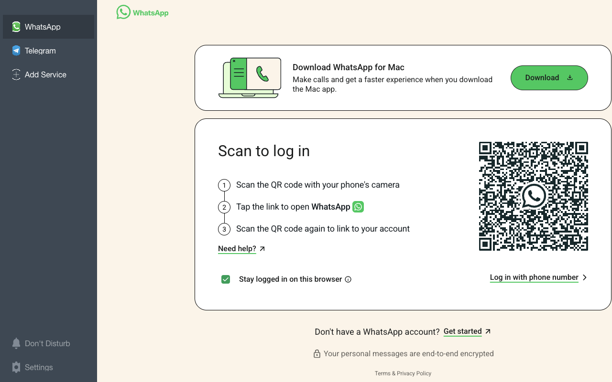
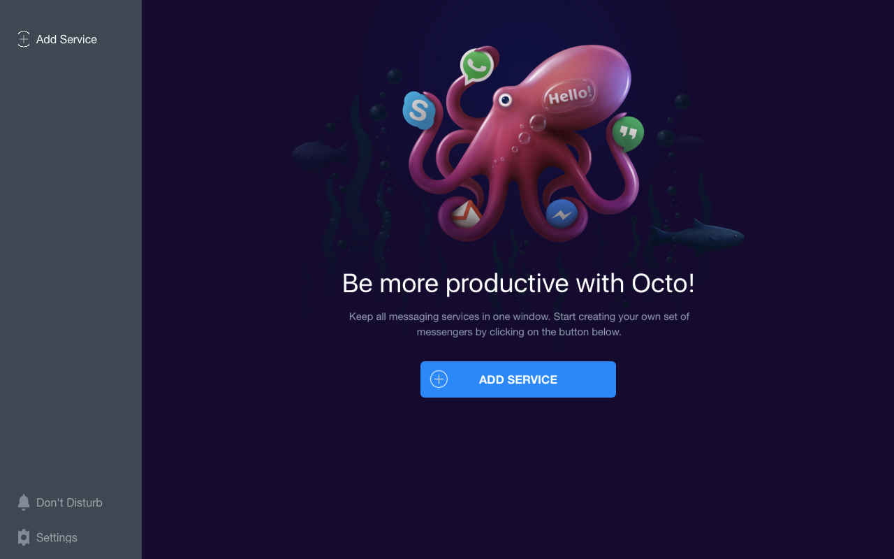
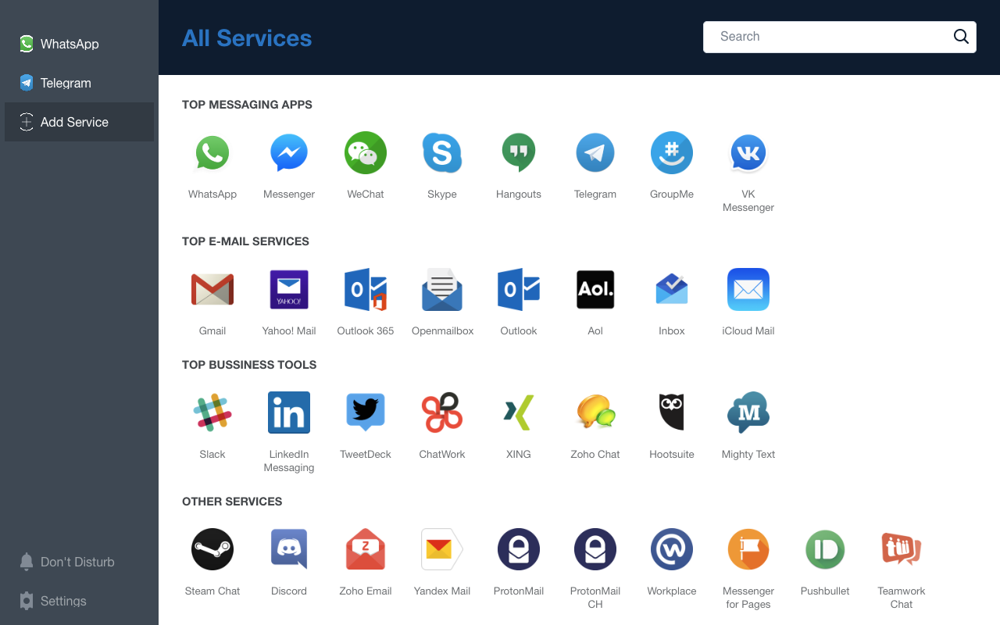

<p align="center">
  
</p>

<h1 align="center">Octo</h1>

<p align="center">
  All your messengers in one window.<br>
  A free, open-source desktop app for macOS, Windows and Linux.
</p>

<p align="center">
  
</p>

---

## What it is

Octo is the app I use to keep my chats in one place. Instead of six browser
tabs and four native clients, every messenger I care about lives in one
window, each in its own tab with its own unread counter and notifications.

It started as a fork of [Rambox](https://github.com/saenzramiro/rambox) and
grew into my own setup: a cleaned-up interface, no accounts, no sync backend,
no telemetry. It is built with Electron and Ext JS. I maintain it because I
use it every day, and I share it here in case it is useful to you too.

## Features

- **One window for everything.** WhatsApp, Telegram, Messenger, Slack, Skype,
  Hangouts, Gmail, Outlook, Discord and many more, plus any custom site you
  want to pin as a tab.
- **Unread counters.** Each tab shows its own count; the dock and taskbar
  badge show the total.
- **Notifications you control.** Per-service notifications and sound, and a
  one-click *Don't Disturb* that mutes everything.
- **Sessions that stay separate.** Every service runs in its own isolated
  partition, so you can be logged into two accounts of the same service.
- **Lock it.** A master password locks the window while you are away.
- **Keyboard first.** `Ctrl/Cmd + 1..9` jumps between tabs, `Ctrl/Cmd + Tab`
  cycles, `Ctrl/Cmd + R` reloads the current service, `F1` toggles
  *Don't Disturb*, `F2` locks the app.
- **Nothing phones home.** No analytics, no accounts, no update pings. Your
  configuration is stored locally and nowhere else.

## How to use it

<p align="center">
  
</p>

1. Open Octo and click **Add Service**.
2. Pick a service from the list, or search for it. For services that need a
   workspace or team address (Slack, for example) you will be asked for it.
3. Sign in inside the tab exactly as you would in a browser.
4. Repeat for every messenger you use. Drag tabs to reorder them.

<p align="center">
  
</p>

The **Settings** tab lists your services and lets you toggle notifications and
sound per service or remove one. **Preferences** (from the app menu) covers
window behaviour, auto start, proxy and language.

## Install

Grab the build for your platform from the
[releases page](https://github.com/Techblogogy/Octo/releases), or build it
yourself (see below).

## Build from source

You need [Node.js](https://nodejs.org) (LTS) and npm.

```sh
git clone https://github.com/Techblogogy/Octo.git
cd Octo
npm install
npm start
```

That is the whole dev loop: the Ext JS app runs straight from source, there
is no compile step. Styles live in `sass/octo.scss` and are compiled with
dart-sass:

```sh
npm run build:css     # once
npm run watch:css     # while working on styles
```

Packages for distribution are produced with electron-builder:

```sh
npm run build:osx
npm run build:win
npm run build:linux
```

### Project layout

```
electron/     main process: window, tray, menu, IPC
app/          Ext JS application (views, stores, the webview component)
resources/    icons, translations, compiled stylesheet, webview preload
sass/         theme sources
ext/          Ext JS 5.1 framework (vendored)
```

### Adding a service

Services are defined in `app/store/ServicesList.js`. An entry needs an id,
a name, a logo in `resources/icons/`, the URL and optionally a `js_unread`
snippet that reports the unread count through `rambox.setUnreadCount(n)`.
Pull requests that add or fix services are welcome.

## Credits and licence

Octo is a fork of [Rambox](https://github.com/saenzramiro/rambox) by Ramiro
Saenz. Thank you for the foundation.

Octo is not affiliated with any of the services it can display. All product
names, logos and brands are property of their respective owners.

Licensed under the [GNU GPL v3](LICENSE).
